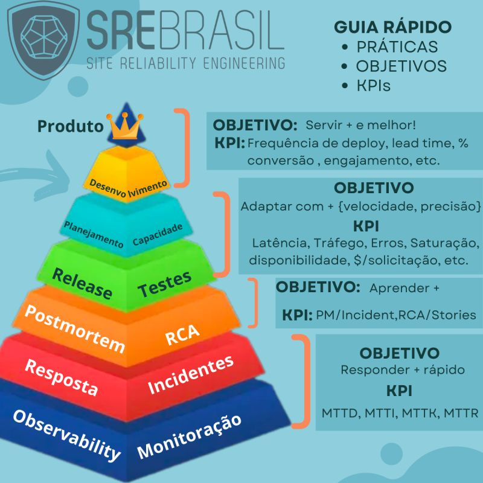

# Qual objetivo e quais os KPIs para adoção das práticas de engenharia de confiabilidade?

Além de um conhecimento profundo sobre o que cada prática significa, a adoção de práticas de engenharia de confiabilidade requer a definição clara de objetivos, e também de quais indicadores chave precisaremos acompanhar para assegurar que estamos melhorando com o tempo.

Obs: O guia abaixo não tem a intenção de ser completo e sim de servir como um guia de bolso.

